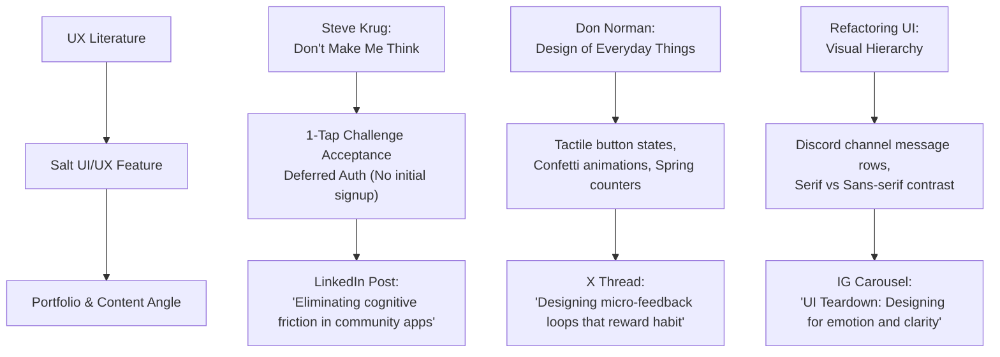

# 🧂 SALT — Master UX & Product Design Blueprint
**Author:** Utobivbi Q. Oghenetega  
**Project:** App 1 of 3 (90-Day Build Challenge)  
**Stack:** Vite · React · Tailwind CSS / Vanilla CSS · AI-Assisted Development (Vibecoding)  
**Design Reference:** Minimal Card Design System (Chahat Soni Style) + Discord Channel Layout for Gist Corner  
**File Location:** `C:\Users\teeut\Downloads\salt-master-ux-design-blueprint.md`

---

## 1. Product Overview & Core Vision

**Salt** is a daily faith-in-action mobile web application designed to turn passive spiritual reflection into real-world acts of love, kindness, and stewardship.

### The Core Problem
Most faith apps are passive — users read a devotional, close the app, and forget about it. Faith was meant to be lived out through active, tangible service in everyday life.

### The Solution: 2 Core Narratives
1. **Narrative 1: The Daily Action Prompt Card**  
   Every 24 hours, users receive a single, high-impact real-world challenge (e.g., *"Pay someone's bus fare today without letting them know it was you"* or *"Buy lunch for a security guard or street worker"*).
2. **Narrative 2: The Gist Corner (Discord-Style Community Channel)**  
   A Discord-inspired community channel (`#gist-corner`) where users post photo proof, voice notes, and stories of how today's challenge went, receiving community encouragement through inline emoji reaction pills (`[ 🙏 89 ] [ 🔥 34 ] [ 💙 12 ]`).

---

## 2. Naming & Positioning

* **App Name:** **Salt**
* **Scriptural Anchor:** *"You are the salt of the earth."* — Matthew 5:13
* **Brand Positioning:** *"Small daily acts create a ripple of testimonies."*
* **Design Tone:** Ultra-minimalist, editorial, serene, clean monochromatic cards (Chahat Soni aesthetic), high contrast, zero neon ambient glows, crisp 1px borders (`rgba(255,255,255,0.08)`).

---

## 3. UX Craft & Literature Application

To elevate your UX design craft and build your personal authority as a product builder, every design choice in **Salt** is directly grounded in core UX literature:

### 🔬 Detailed UX Heuristics in Salt:

1. **Zero-Friction Participation (Steve Krug):**
   * Users can accept the daily challenge with **1 tap without signing up**.
   * Auth is deferred until they post a story in `#gist-corner`.
2. **Affordance & Micro-Feedback (Don Norman):**
   * The *"I'm In! Take Challenge"* CTA button uses tactile 3D bottom depth and active spring press states.
   * Instant feedback upon tapping: smooth number increment animation on the live counter (`1,420 believers accepted today`) + celebratory micro-confetti burst.
3. **Discord-Style Information Architecture (Discord + Chahat Soni):**
   * **Channel Layout:** Top header displaying `#gist-corner` channel name and topic description.
   * **Message Rows:** Avatar on the left, Username + Time + Role Tag (`BUILDER`) in meta row, formatted text body, embedded media proof box, and inline reaction pills (`[ 🙏 89 ] [ 🔥 34 ]`).
   * **Thread Triggers:** Inline `💬 14 replies` button to open nested discussion drawers.

---

## 4. Benchmark App Inspirations

| App / Platform | Feature Obeyed | Implementation in Salt |
|---|---|---|
| **Discord** | **Channel & Message Row Layout** | Gist Corner feed uses Discord's channel header (`#gist-corner`), avatar + message row, embedded attachments, inline reaction pills, and thread triggers. |
| **Chahat Soni (Minimal Card Design)** | **Ultra-Clean Monochromatic Bento Cards** | Crisp off-black surfaces (`#09090c`), subtle 1px borders, generous padding, zero neon/glow noise. |
| **BeReal** | **Single Daily Trigger** | Screen 1 centers 100% of user attention on *one* challenge card with a countdown timer (`⏰ Resets in 08:42:19`) and live participant count. |
| **Duolingo** | **Tactile Feedback & Streaks** | Clean press button + `🔥 14 Days` streak counter pill in the top header. |

---

## 5. UI Architecture & Modern Trends

### 🌟 Floating Monochromatic Glass Navigation Bar
Following modern UI trends (iOS 18, Linear, Arc, Raycast), **Salt** uses a suspended, floating pill navigation bar:
* **Background:** `rgba(14, 14, 18, 0.88)` with `backdrop-filter: blur(20px)`.
* **Border:** `1px solid rgba(255, 255, 255, 0.12)`.
* **Elevation:** Floating 16px off the bottom screen edge with soft dark shadow.
* **Active Indicator:** Subtle white dot indicator underneath the active tab icon (`⚡ Today` / `💬 Gist Corner` / `👤 Profile`).

---

## 6. 5-Day Vibecoding Build Roadmap

| Day | Build Objective | Key Deliverables |
|---|---|---|
| **Day 1** | **Project Setup & Minimal Card UI** | Vite + React + Tailwind setup; build Chahat Soni-style minimalist challenge card & timer component. |
| **Day 2** | **Interactions & Local State** | 1-Tap challenge button state, live counter increment animation, `localStorage` persistence. |
| **Day 3** | **Discord Gist Corner Feed UI** | `#gist-corner` channel layout, message rows, photo upload modal, reaction pill buttons. |
| **Day 4** | **Floating Glass Nav & Polish** | Backdrop blur glass nav bar, dark mode token refinements, Norman UX heuristics pass. |
| **Day 5** | **Deployment & Demo** | Deploy on Vercel/Netlify; record screen video & screenshots for Instagram/X. |

---

## 🔗 Interactive Artifacts & Prototypes Ready on Your Machine:
- **Interactive UI Prototype:** Open `C:\Users\teeut\Downloads\salt_ui_prototype.html` or visit `http://localhost:8080`
- **Personal Portfolio:** Open `C:\Users\teeut\Downloads\utobivbi_portfolio.html`
- **Week 1 Manifesto Essay:** Open `C:\Users\teeut\Downloads\week1-medium-essay-manifesto.md`
