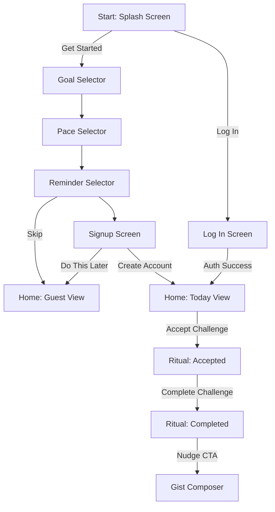

# User Journey Blueprint: Action & Animation Progression

This document outlines the end-to-end user journey flow in the **Salt** application, detailing the transitions, animations, and database interactions triggered at each step of the lifecycle.

---

## 1. Onboarding & Authentication Flow

### Screen 1: Splash Screen (Initial Entry)
* **Visuals & State**: Animated premium mesh gradient overlay with a spinning crystal brand logo. Custom 3D companion guide avatar loads inside a header badge.
* **User Actions & Progression**:
  * **Switch Companion Guides**: Tapping guide buttons (`mixed`, `beige`, `grey`) runs `setCompanionProfile(profile)`. This saves choice to local storage, changes companion images across all views, and updates dialogue sets.
  * **Trigger Log In**: Tapping "Already have an account? Log In" runs `goToLoginPage()`, sliding Screen 1 out and bringing Screen 1B in.
  * **Trigger Onboarding**: Tapping "Get Started" runs `goToGoalSelector()`, moving user to Screen 2.

### Screen 1B: Dedicated Log In Page
* **Visuals**: Form fields for email address and password.
* **User Actions & Progression**:
  * **Field Input Validation**: Email requires `@`; password requires a minimum of 6 characters.
  * **Log In Submission**: Clicking "Log In" runs `executeLogin()`.
    * If `useFirebase` is active, it calls Firebase Auth `signInWithEmailAndPassword()`.
    * **Success**: Real-time auth listener `onAuthStateChanged` fires, loads Firestore profile document, saves data to local storage, triggers a full-screen confetti burst, and fades the onboarding overlay to reveal the default **Today View**.
    * **Failure**: Displays field errors under input forms.

### Screen 2: Goal Selector
* **Visuals**: Glassmorphic onboarding selection cards representing goals.
* **User Actions & Progression**: Tapping a card highlights it, updates the onboarding header progress bar, and automatically slides to Screen 3.
* **Animations**: Duolingo-style click press bounce on card selection.

### Screen 3: Pace Selector
* **Visuals**: Frequency selection cards (e.g. 1 act/wk, 3 acts/wk, daily act).
* **User Actions & Progression**: Tapping a card highlights choice, updates progress bar, and automatically slides to Screen 4.

### Screen 4: Daily Reminder Time
* **Visuals**: Time picker input alongside a mock iOS push notification panel preview.
* **User Actions & Progression**:
  * **Time Customization**: Changing the time runs `updateMockNotifTime(val)`, which dynamically slides the time text in the mock notification box.
  * **Turn on Reminders**: Clicking CTA saves the reminder time and moves to Screen 5.
  * **Skip Option**: Clicking "Skip" in the top header runs `finishOnboardingQuiz()`. This registers the user as a "Guest" locally, saves configurations, fades the onboarding overlay, and reveals the Today view.

### Screen 5: Streak Profile Signup (Final Step)
* **Visuals**: Live Profile Card preview box and text inputs (Name, Email, Password, Bio).
* **User Actions & Progression**:
  * **Live Typing Sync**: Inputting name or bio dynamically updates the preview card.
  * **Create Account CTA**: Enabled once name, email, and password validate. Clicking CTA runs `finishSignUpAndProceed()`.
    * Calls Firebase Auth `createUserWithEmailAndPassword()`.
    * Creates user profile document in Firestore: `/users/{uid}`.
    * Triggers full-screen confetti burst, chimes play, onboarding overlay fades out to Home.
  * **Do This Later**: Clicking link runs `skipProfileSetup()`, bypasses authentication, registers user as Guest, and opens Home.

---

## 2. In-App Core Functions

### A. Today View (Home Tab - Default Route)
* **Visuals**: Current challenge statement, daily scripture reference, weekly progress dots, community completions counter, and the companion guide character widget.
* **User Actions & Progression**:
  * **Accept Challenge**: Clicking "I'm In! Take Challenge" runs `handleCtaInteraction()` (Stage 1):
    * Updates user doc in Firestore (`isAccepted = true`).
    * CTA button transitions to grey "Mark Completed" state.
    * Today's circle in the weekly tracker row turns into an orange progress dot (`•`).
    * Start countdown timer display appears.
    * Character mascot transitions to `reflective` state and updates dialogue bubble.
    * Triggers a simulated iOS push reminder notification in 7 seconds if the challenge is not marked completed.
  * **Complete Challenge**: Clicking "Mark Completed" runs `handleCtaInteraction()` (Stage 2):
    * Appends date string `YYYY-MM-DD` to the completions array in Firestore `/users/{uid}`.
    * Recalculates consecutive streak count (resetting to 0 if yesterday was missed).
    * Runs a Firestore transaction to increment completions count in `/stats/today`.
    * CTA button transitions to a green Volt badge: `✓ Challenge Completed!`.
    * Today's circle in the weekly tracker row turns into a green checkmark (`✓`).
    * Full-screen screen confetti canvas burst triggers; high-frequency chime sounds.
    * Companion avatar transitions to `celebrating` state.
    * A glassmorphic bottom sheet slides up, nudging the user to share their story in Gist Corner.

### B. Gist Corner (Community Tab)
* **Visuals**: Testimony feed list, react buttons, and a sliding Gist Composer panel.
* **User Actions & Progression**:
  * **Write Testimony**: Clicking composer textarea reveals composer actions.
  * **Emotion-Responsive Mascot**: Typing runs real-time sentiment analysis. If positive/joyful words are detected, the mascot badge smiles/celebrates. If reflective/prayerful words are detected, it shows a calm/prayerful portrait.
  * **Publish Testimony**: Clicking "Share Story" runs `submitGist()`, adding a document to `/gists` in Firestore.
  * **Real-time Synchronization**: A Firestore collection snapshot listener (`onSnapshot`) captures the publish instantly, appending the new card at the top of the feed for all active users with a slide-in animation.
  * **Emoji Reactions**: Tapping a react button runs `toggleFirebaseReaction()`, updating reaction map counters inside the Firestore gist document.

### C. Profile & Settings Tab
* **Visuals**: User profile initials card, stats slots (Streak, Completes, Gists), Companion Logbook tracker card, settings toggle list.
* **User Actions & Progression**:
  * **Inline Bio Editor**: Clicking the bio text reveals an input field. Pressing `Enter` runs `stopEditingBio(true)`, saving the bio in Firestore and local storage.
  * **Settings Preferences**: Toggling sound, push, or anonymity switches updates Firestore preferences in real-time.
  * **Companion Logbook**: Shows Wisdom Points progress bar and current Companion Title Tier.
  * **Admin Console**: Logged in as `teeutos@gmail.com` reveals a tool button. Tapping it slides up the Admin Control Center panel to push live challenges, manage queues, or toggle feed moderation delete tools.

---

## 3. Visual Presentations, Animations & Movement Mechanics

This section outlines the tactile feedback, canvas engines, and user-facing movement transitions that define the Salt user experience.

### A. Companion Mascot Interactive Movements (Drag-and-Dock)
* **Touch & Mouse Tracking**: Users can grab the peeking guide avatar on mobile to reposition it vertically. The `dragStart` and `dragMove` handlers capture client pointer coordinates (`clientX`, `clientY`) and translate the widget container's vertical offset.
* **Smart Edge Docking**: On pointer release (`dragEnd`), the widget calculates horizontal thresholds. 
  * If released on the right half, it executes a CSS transition to slide and snap flush to the right viewport boundary, updating the container border-radius to `50% 0 0 50%`.
  * If released on the left half, it snaps flush to the left boundary, modifying the border-radius to `0 50% 50% 0`.
* **Desktop Layout Lock**: On screens `>= 768px`, all drag events are automatically disabled. The companion settles into a static grid card layout on the right column of the Today View to prevent layout occlusion.
* **Tickle Feedback Animation**: Clicking the avatar badge multiple times triggers a wobble rotation scale animation (`.side-sticky-guide.tickled`), accompanied by contextual dialogue responses expressing surprise or playfulness.

### B. Tactile Micro-Feedback (Duolingo 3D Press Dynamics)
* **Tactile Button Press**: Main Ember CTA buttons (`.locket-cta-btn`) utilize a CSS 3D layer depth simulation (`box-shadow: 0 4px 0 var(--ember-depth)`). On press, it translates downward (`transform: translateY(4px); box-shadow: none;`) to simulate a physical, tactile spring key.
* **Card Elasticity**: Goal and pace selection cards respond to hovers with scale magnification (`scale(1.02)`) and background glow glows (`box-shadow: 0 0 20px var(--volt-subtle)`). Tapping them triggers a springy press down and up.

### C. Canvas-Driven Visual Engines
* **Spinning Logo Crystal**: A custom 2D canvas drawing loop (`saltLogoCrystalCanvas`) executes on startup. It mathematically projects a rotating 3D octahedron crystal using coordinate translation matrices. It renders reflective faces that scale dynamically based on light/dark mode color changes.
* **WebGL Confetti Engine**: A full-screen particle physics engine (`#confettiCanvas`) triggers on challenge completion. It instantiates 120 multicolored paper particles, tracking individual gravity indexes, horizontal wind drag, rotation velocity, and side-to-side sine-wave oscillations as they fall down the screen.

### D. Cinematic View, Drawer & Sheet Transitions
* **Onboarding Panel Slider**: Transitions between screens inside `viewOnboarding` utilize left/right CSS translations (`transform: translateX(100%)` to `translateX(0)`) combined with elastic cubic-bezier timing functions (`cubic-bezier(0.16, 1, 0.3, 1)`).
* **Translucent Drawer Sheets**: Bottom-sheets (Auth Landing, Gist Composer, Gist Nudge) slide up from bottom off-screen bounds (`translateY(100%)`) to their active viewport states (`translateY(0)`). A dark background overlay fade-in locks parent view inputs, applying a glassmorphic blur (`backdrop-filter: blur(12px)`).
* **Elastic Modal Zoom**: Daily Bread and Level-Up modals trigger on completion. They use a combined scale-fade entrance (`transform: scale(0.85) -> scale(1.05) -> scale(1.00)`) with springy bounces.
